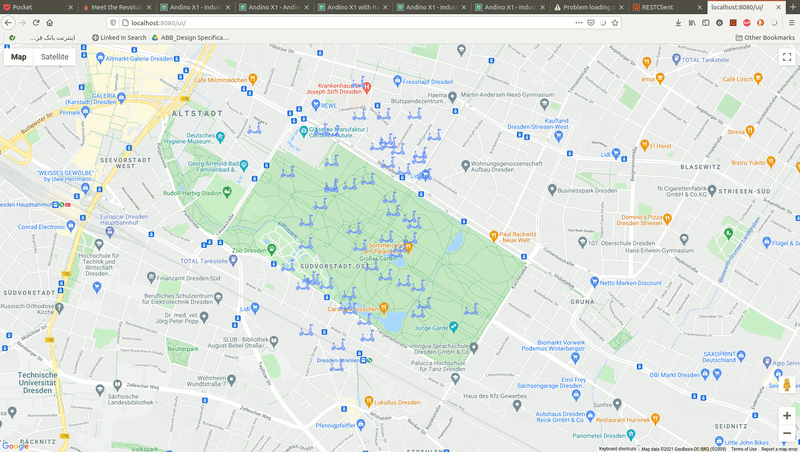

# Scootin
This is a backend service that exposes a REST API intended for scooter event collecting and reporting to mobile clients. Mobile clients can query scooter locations and statuses in any rectangular location (e.g. two pair of coordinates), and filter them by status. 
While there will be no actual mobile clients, another service called `dummy-client` is implemented which spawns a configurable number of fake clients that run nearly simultanouse in individual _Goroutines_ (finding scooters, travelling for 10-15 seconds whilst updating location every 3 seconds, and resting for 2-5 seconds before starting next trip).

To see details and examples about the APIs head over to the [API Documentation](APIs.md).


## Quick Setup

To setup and run the Service simply copy and execute the following code into your terminal:

```
git clone https://github.com/mojtaba-esk/scooter-event-reporting-service.git
cd scooter-event-reporting-service
sudo docker-compose up -d
```
Note: _The database, tables, indices, etc will be created automatically on the first launch and will be filled with some random data._

Once it is up, you can see the status of moving scooters in your browser: http://localhost:8080/




## Development
To activate the development mode you need to open `docker-compose.yml` file, under the desired service (e.g. server), change the target to development:

```
    build:
      context: ./client
      target: development  # development | test | production (default)
```

## Test
Please Change the target to `test` then build the API server container:

`sudo docker-compose up --build server` 

You will see the test result in the terminal.

## Logs
See API server logs:
`sudo docker logs -f scootin-api-server`

See the dummy client logs:
`sudo docker logs -f scootin-dummy-client`


## ENV variables
### Server:
- `SERVING_ADDR`: Service address for the API server
- `STATIC_API_KEY`: Static API Key to Autheticate to the APIs

- `REDIS_USER`: Redis Username (_Please note that the current version of the Service does not use redis_)
- `REDIS_PASSWORD`: Redis Password
- `REDIS_HOST`: Redis Host
- `REDIS_PORT`: Redis Port
- `REDIS_DB`: Redis Database number (_default:_ 0)

- `POSTGRES_DB`: PostgreSQL database name
- `POSTGRES_USER`: PostgreSQL username with correct autorizations
- `POSTGRES_PASSWORD`: PostgreSQL password
- `POSTGRES_PORT`: PostgreSQL port
- `POSTGRES_HOST`: PostgreSQL Hostname

### Dummy Client:
- `SCOOTIN_API_PATH`: The path to the API server
- `STATIC_API_KEY`: Static API Key to Autheticate to the APIs
- `NUM_OF_CLIENTS`: Number of dummy clients

If you change ech of these values in the `docker-compose.yml` file, you need to run the follwoing command in order to reflect the changes: `sudo docker-compose up -d`

PS: this command must be executed in the same directory where `docker-compose.yml` file is located (_e.g. scooter-event-reporting-service_).
